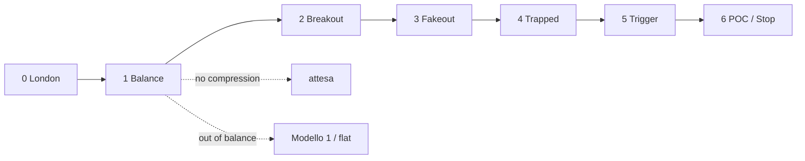

# Modello 2 — Mean Reversion · Analisi implementazione

**Fonte:** transcript *Trading LIVE with the #1 Scalper in the WORLD (EXTREME Accuracy)*  
**Trader:** Fabio Valentino — top 3 Robins Cup (500%+ ritorno 12 mesi, futures NQ)  
**Stato codice:** [AGENTS.md](../../AGENTS.md)

---

## Tesi

Mean reversion in mercato **in balance**. Il segnale non nasce da wick, delta o CVD isolati, ma dalla sequenza:

**profile → breakout → fakeout → trapped side → aggressione → rientro → target POC**

> *"Il Modello 2 è mean reverting... consolidamento... condizione out of balance che rientra dentro il balance."*

**Prerequisito assoluto:** mercato in consolidamento. Se out of balance → Modello 1 o flat.

### Concetti chiave dal transcript

| Concetto | Definizione Fabio | Implicazione operativa |
|----------|-------------------|------------------------|
| **Stato mercato** | Bilanciato vs sbilanciato — *"Il mercato è solitamente in balance. Solo il 30% andrà oltre"* | Si opera **solo** in bilanciato; sbilanciato → Modello 1 o flat |
| **Location** | Dove siamo nel profile — *"Capire la location è quando puoi operare efficientemente quando sei out of balance"* | Il profile determina se siamo in discount/premium/fair value |
| **Aggressione** | Big trade (ball) — *"Quando c'è direzione, location e aggressione la tua capacità di predire è zero ma la tua capacità di leggere è 100"* | Trigger del modello — non predire, **leggere** |
| **Edge decay** | *"Quando il tuo modello perde edge... con l'order flow non puoi avere edge decay perché quello che guardi è la vera natura del mercato"* | L'analisi volume non decade come le strategie basate su pattern fissi |
| **Secondo drive** | *"Non entro quando sono così aggressivi... aspetto che completino questo movimento"* | Mai prendere il primo breakout — aspettare il secondo tentativo |

### Differenza Modello 1 vs Modello 2

| Aspetto | Modello 1 (Trend Following) | Modello 2 (Mean Reversion) |
|---------|----------------------------|---------------------------|
| **Stato mercato** | Sbilanciato (trend) | Bilanciato (consolidamento) |
| **Sessione** | New York | London (primario), mesi estivi |
| **Setup** | Breakout + retest + continuation | Breakout fallito + rientro in balance |
| **Target** | Area balance precedente (POC precedente) | POC del range corrente |
| **Win rate atteso** | 50-60% con 1:3+ RR | 60-70% con 1:2.5+ RR |
| **Caratteristica** | *"Quando NASDAQ spinge forte... 1 a 30, 1 a 40"* | *"Il consolidamento uccide il win rate... ma un TP è 15-20K"* |

> *"Quando perdo con uno faccio profitto con l'altro. È come bilanciare la curva di equity."*

---

## Pipeline — 7 step

| Step | Nome | Cosa fa | Gate / output |
|------|------|---------|---------------|
| **0** | Contesto | Sessione London (`TradingSessionDescriptions`) | `VALID` / `RISKY` / `INVALID` |
| **1** | Balance | Compression profile → POC, VAH, VAL | vedi stati sotto |
| **2** | Breakout | Prezzo esce oltre VAH/VAL | `FIRST_BREAKOUT_WAIT` — no entry |
| **3** | Fakeout | Breakout senza follow-through, rientro verso value | `FAKEOUT_WATCH` |
| **4** | Trapped | Aggressione fuori value + no follow-through + recupero | `TRAPPED_*_WATCH` |
| **5** | Trigger | Second drive + big trade / squeeze | `TRIGGER_LONG` / `TRIGGER_SHORT` |
| **6** | Gestione | Target POC, stop, invalidazione | `INVALIDATED` |



---

## Step 1 — Balance

### Dal transcript

Il punto difficile è *"identificare correttamente il consolidamento"*. Fabio traccia il Volume Profile sull'**area di compressione** — dove il mercato *"non transa più alto né basso"* — e da lì estrae POC, VAH, VAL.

> *"La parte difficile è identificare correttamente il consolidamento perché puoi renderlo il più semplice possibile... uso il profile del giorno precedente."*

> *"Lo stato del mercato è consolidamento ed è quando il profile protegge da rompere qui e rompere qui."*

| Timestamp | Cosa dice Fabio |
|-----------|-----------------|
| ~47:17 | *"La parte difficile è identificare correttamente il consolidamento"* |
| ~47:28 | Metodo semplice: *"Uso il profile del giorno precedente"* |
| ~47:47 | Metodo operativo: *"Vedi le candele compresse e ci tracci sopra il profile"* |
| ~59:45 | *"Identificare l'area di compressione più interessante... dove il mercato non ha transato più alto né basso"* |
| ~1:00:24 | *"Non la identifichi immediatamente... è troppo presto"* |
| ~1:11:19 | Dentro la stessa consolidazione: *"da qui a qui... nuovo dealing range"* → replot profile |
| ~1:26:07 | Su 1m: *"profile dalla prima all'ultima ball"* per micro-compressione |
| ~3:01:26 | *"L'era di consolidamento è ancora la stessa"* — finché VAH/VAL non rompono |
| ~3:01:40 | Validazione live: *"Ha rotto il value area low? No. Ha rotto il value area high? Sì."* |

Due concetti distinti:

| Concetto | Cosa è | Ruolo |
|----------|--------|-------|
| **Sessione London** (Step 0) | *"Guardi potenzialmente a London"* — finestra operativa | **Quando** si opera |
| **Zona di balance** (Step 1) | Profile su area di compressione → POC/VAH/VAL | **Dove** è il range e i livelli |

`IsNewSession` serve per Step 0 (London via `TradingSessionDescriptions`). Il range profile parte dall'inizio compressione, non da `IsNewSession`.

| Elemento | Regola |
|----------|--------|
| Range profile | Inizio compressione → barra corrente (rolling) |
| Timing | Quando la compressione è **visibile**; altrimenti `NO_COMPRESSION` (*"troppo presto"*) |
| Fallback | Daily profile del giorno precedente (contesto macro) |
| Replot | Nuovo range *"da qui a qui"* dentro la stessa *era di consolidamento* |
| Fine balance | Rottura VAH/VAL con follow-through → fine era, cerca nuova compressione |

### Cosa fa Fabio per individuare la balance

**Modalità A — Semplice (contesto macro)**

> *"Puoi renderlo stupidamente semplice mettendo solo il daily profile."*  
> *"Uso il profile del giorno precedente."*

Profile del **giorno precedente** → POC/VAH/VAL come riferimento. Facile, meno preciso intraday.

**Modalità B — Operativa (Modello 2 live)**

> *"Vedi le candele compresse e ci tracci sopra il profile."*

1. Individua dove il mercato **non transa più alto né basso** (compressione visibile)
2. Traccia il Volume Profile **solo su quell'area**
3. Estrae POC, VAH, VAL (value area del profile — bulk of auction)
4. Verifica che il profile **protegga** i confini

> *"Lo stato del mercato è consolidamento ed è quando il profile protegge da rompere qui e rompere qui."*

**Refinement intraday**

| Situazione | Fabio | Azione sul profile |
|------------|-------|-------------------|
| Nuovo dealing range dentro la stessa consolidazione | *"Da qui a qui... nuovo dealing range"* | Replot sul nuovo range compressione |
| Micro-contesto su 1m | *"Profile dalla prima all'ultima ball"* | Profile tra primo/ultimo cluster aggressione |
| Era di consolidamento ancora valida | *"L'era di consolidamento è ancora la stessa"* | Stessi VAH/VAL finché non rompono |
| Era finita | *"Ha rotto VAH? ... Ha rotto VAL?"* con follow-through | Reset → cerca nuova compressione |

**Cosa NON è balance**

| Situazione | Perché non è balance | Cosa fare |
|------------|---------------------|----------|
| Mercato con momentum | *"Piccoli ordini in balance → qualcuno compra aggressivamente e continuation"* | Aspettare che il momentum si esaurisca |
| Giornata news/gap estremo | *"Bombing Iran... gap down pesante. Non puoi aspettarti che il mercato oggi si comporti come venerdì"* | Contesto `RISKY` — modello meno affidabile |
| Pre-market opening | *"Non opero mai pre-market perché vedi la battaglia ma non sai chi vincerà"* | Aspettare 5-15 min dopo apertura |
| Prime 10-20 min sessione | *"Sarai liquidato e poi forse la tua direzione era giusta. Ma sarà per la volatilità"* | Noise — aspettare che la direzione si chiarisca |
| Compression day (estate) | *"I giorni di consolidamento ti uccidono... cinque piccoli stop-loss"* | Accettare WR più basso o non operare |

### Principio: tutto dinamico (tranne big trades)

Fabio non ragiona con numeri fissi su struttura e profile. Compressione, breakout, fakeout e follow-through emergono dal **contesto live**: range recente, volume, livelli VAH/VAL, comportamento post-rottura.

**Eccezione — filtro big trade:** sulle executions usa una **soglia fissa in contratti**, oggettiva e testabile:

| Timestamp | Cosa dice Fabio |
|-----------|-----------------|
| ~24:47 | *"Metti un filtro di 30 contratti su NASDAQ al minuto... vedrai la palla. Quindi è davvero oggettivo."* |
| ~1:31:44 | *"Per i cinque minuti e il minuto per la sessione New York puoi usare 30 contratti come filtro."* |
| ~1:31:52 | *"Durante la sessione London puoi andare con 20. È abbastanza preciso."* |
| ~1:31:58 | Ball più grande del filtro = aggressione maggiore (es. 100 contratti) — dimensione proporzionale sul chart |

| Sessione | Timeframe | Filtro big trade (NQ) |
|----------|-----------|------------------------|
| **London** | 1m / 5m | **20 contratti** |
| **New York** | 1m / 5m | **30 contratti** |

API: `OnCumulativeTrade` (fallback `OnNewTrade`) — print ≥ soglia sessione = "ball" visibile.

| Area | Logica |
|------|--------|
| Compressione, profile, VAH/VAL | Dinamica — relativa a range e volume del momento |
| Breakout / fakeout | Dinamica — livello profile + follow-through |
| **Big trades / balls** | **Soglia fissa** per sessione (20 London, 30 NY) |

### Specifica implementativa

#### A. Trovare l'area di compressione

Fabio seleziona visivamente l'area dove il prezzo *"non transa più alto né basso"*. In codice il range profile è **rolling**: fine = barra corrente, inizio = dove inizia la compressione rilevata.

**Algoritmo `FindCompressionStart(bar)`:**

```
1. Da bar corrente, scansiona all'indietro
2. Trova l'ultimo impulse — leg direzionale con espansione del range
   (close oltre swing precedente, range/volume in crescita vs leg precedente)
3. Inizio compressione = prima barra dopo l'impulse dove high/low restano
   contenuti in un range nettamente più stretto del leg espansivo
4. Conferma: il range della compressione non si espande in modo direzionale;
   le candele sono "compressed" rispetto al contesto appena precedente
```

Se la compressione non è ancora leggibile sul chart → `NO_COMPRESSION` (*"troppo presto"*).

#### B. Costruire il profile sul range

```
Per ogni barra nell'area di compressione (inizio → corrente):
  per ogni livello in GetCandle(b).GetAllPriceLevels():
    accumula volume per prezzo

POC  = prezzo con volume massimo
VAH/VAL = value area (bulk of auction) espansa dal POC fino a ~70% del volume
```

API ATAS: `GetCandle(bar).GetAllPriceLevels()` → `Price`, `Volume`, `Ask`, `Bid`.

#### C. Validare che sia balance (solo profile calcolabile)

| Check | Fabio | Logica dinamica |
|-------|-------|-----------------|
| Compressione visibile | Candele strette, no espansione direzionale | Range corrente contratto vs ultimo impulse; profile accumula volume sufficiente |
| Profile protettivo | VAH/VAL tengono | Tentativi di rottura senza follow-through sostenuto |
| Prezzo in value | Oscilla nel balance | Close dentro/near value area definita dal profile stesso |
| No momentum | No aggressione continua oltre confini | Aggressione oltre VAH/VAL non produce continuation |

#### D. Stati Step 1

| Stato | Significato | Equivalente Fabio |
|-------|-------------|-------------------|
| `NO_COMPRESSION` | Compressione non ancora visibile | *"troppo presto"* |
| `COMPRESSION_FORMING` | Range c'è, profile sottile o confini non ancora affidabili | Compressione in formazione |
| `BALANCE_READY` | POC/VAH/VAL validi, confini protettivi, prezzo in/near value | *"era di consolidamento"* attiva |
| `OUT_OF_BALANCE` | Rottura VAH/VAL con follow-through | Fine era → Modello 1 o flat |

#### E. Quando si aggiorna / si resetta

| Evento | Azione |
|--------|--------|
| Nuova barra in compressione | Profile rolling: estendi range fino a barra corrente |
| Nuovo dealing range (*"da qui a qui"*) | Replot: nuovo inizio compressione |
| Rottura VAH/VAL con follow-through | Fine *"era di consolidamento"* → reset, cerca nuova compressione |
| Modalità fallback | `PreviousDayProfile` per contesto macro |

#### F. Timeline tipica London

```
London open
    │
    ▼
NO_COMPRESSION          → "troppo presto", profile instabile
    │
    ▼  (compressione diventa visibile)
COMPRESSION_FORMING     → range rilevato, POC/VAH/VAL emergono
    │
    ▼
BALANCE_READY           → confini tengono, prezzo in value
    │
    ▼
Step 2+ (breakout, fakeout, trigger...)
    │
    ▼
OUT_OF_BALANCE          → rottura con follow-through, era finita
```

#### G. Pseudocodice Step 1

```csharp
// Gate Step 0
if (!IsInLondonSession(bar)) return;

// A — compressione (NON session start)
var compressionStart = FindCompressionStart(bar);
if (compressionStart < 0) { State = NO_COMPRESSION; return; }

// B — profile sulla compressione
var profile = BuildProfile(compressionStart, bar);
if (!profile.IsValid) { State = COMPRESSION_FORMING; return; }

// C — è balance?
if (BrokeWithFollowThrough(bar, profile.VAH, profile.VAL))
    State = OUT_OF_BALANCE;
else if (profile.IsProtective(bar))
    State = BALANCE_READY;
else
    State = COMPRESSION_FORMING;
```

---

## Step 2–6 (invariati nella logica)

### Step 2–3 — Breakout e fakeout

- Breakout = close oltre VAH/VAL (il livello profile **è** la soglia)
- **Regola Fabio:** primo drive ignorato — attendere il secondo tentativo
- Fakeout = breakout senza follow-through → prezzo rientra inside value

Follow-through = prezzo **continua** oltre il livello con aggressione sostenuta; fakeout = tentativo che **non tiene**.

#### Dal transcript — regola del secondo drive

> *"Non entro quando sono così aggressivi. Quindi il mio ruolo non è predire quando si fermeranno. Aspetto che completino questo movimento. Vedi tutto questo era un fake. La narrativa è ancora long. Tutto questo movimento viene assorbito."*

> *"Questo è un modello... l'unica cosa è che non entro quando sono così aggressivi. Quindi il mio ruolo non è predire quando si fermeranno. Aspetto che completino questo movimento."*

> *"Trend following o reversal. Aspetta il secondo drive. Non prendere il primo drive perché puoi essere preso in un fake out."*

### Step 4–5 — Trapped side e trigger

| Condizione | Conferma trapped | Trigger |
|------------|------------------|---------|
| Prezzo sotto VAL | sell aggression (ball ≥ filtro), no follow-through, recupero verso value | big buy ≥ filtro + recovery / squeeze |
| Prezzo sopra VAH | buy aggression (ball ≥ filtro), no follow-through, rientro in value | big sell ≥ filtro + recovery / squeeze |

- **Big trades:** filtro fisso — **20 contratti** London, **30 contratti** NY su 1m/5m NQ (*"vedrai la palla"*)
- **CVD:** conferma/gestione only
- **Assorbimento:** ball ≥ filtro + no follow-through a livello profile

#### Dal transcript — come riconoscere il trapped side

> *"Quando vedi aggressione e out of balance, il mercato deve cercare nuovo balance. È come un essere umano. Quando siamo in una condizione di paura, il cuore continua ad avere tachicardia finché non torniamo calmi."*

> *"Lo squeeze succede quando prendi il basso e hanno uno, due, tre, quattro, cinque bassi da rivisitare. Quando chiudono la posizione, il mercato salta."*

> *"Tutti questi venditori devono chiudere la posizione. Sì. Questo causa uno squeeze — come se tutti questi venditori chiudessero la posizione il mercato salta e quando arriva a questo livello vedi l'accelerazione."*

#### Dal transcript — assorbimento (concetto chiave)

> *"Venditori aggressivi qui. Nessun follow through. Quindi i compratori stanno proteggendo con ordini limite. O li tagliano attraverso, ma se iniziano a recuperare e tornano dentro il range, questo è un setup."*

> *"Grandi venditori nessun follow up. Piccoli venditori, grandi venditori, enorme follow up e chiusura su questa candela — puoi uscire."*

### Step 6 — Target e stop

| Elemento | Regola |
|----------|--------|
| **Target** | POC (bulk of auction) |
| **Stop** | sotto/sopra failed breakout e cluster aggressione |
| **Invalida** | rottura con follow-through |

#### Dal transcript — gestione trade

> *"Quando ti dico che farò scale out, è esattamente perché quando vedi questo, il prossimo passo sono venditori aggressivi."*

> *"La probabilità è che il mercato si invertirà dal POC il 70% delle volte. Quindi prendiamo l'intera posizione perché non vale la pena mantenere la posizione per solo il 30% di probabilità in più."*

> *"Metti lo stop loss non sopra il massimo. Perché sopra il massimo ci sono molti ordini e quello che vedi è che il mercato accelererà... metti lo stop loss uno o due tick sotto il massimo. Così sei preso fuori prima di tutti quelli prima che l'accelerazione abbia luogo."*

---

## State machine (aggiornata)

| Stato | Step | Entry |
|-------|------|-------|
| `NO_COMPRESSION` | 1 | No |
| `COMPRESSION_FORMING` | 1 | No |
| `BALANCE_READY` | 1 | No — attendere breakout |
| `FIRST_BREAKOUT_WAIT` | 2 | No |
| `FAKEOUT_WATCH` | 3 | No |
| `TRAPPED_SELLERS_LONG_WATCH` | 4 | No |
| `TRAPPED_BUYERS_SHORT_WATCH` | 4 | No |
| `TRIGGER_LONG` / `TRIGGER_SHORT` | 5 | Sì |
| `OUT_OF_BALANCE` | 1+ | No — reset / Modello 1 |
| `INVALIDATED` | 6 | No — reset scenario |

```
NO_COMPRESSION → COMPRESSION_FORMING    (compressione rilevata)
COMPRESSION_FORMING → BALANCE_READY     (profile protettivo)
BALANCE_READY → FIRST_BREAKOUT_WAIT     (rottura VAH/VAL)
FIRST_BREAKOUT_WAIT → FAKEOUT_WATCH     (no follow-through)
FAKEOUT_WATCH → TRAPPED_*_WATCH         (aggressione + recupero)
TRAPPED_*_WATCH → TRIGGER_*             (second drive + big trade)
BALANCE_READY → OUT_OF_BALANCE          (rottura VAH/VAL + follow-through)
* → INVALIDATED                         (invalidazione trade)
```

---

## Input ATAS

| Categoria | Dato | API / fonte |
|-----------|------|-------------|
| Profile | volume per livello | `GetCandle(bar).GetAllPriceLevels()` |
| London (Step 0) | sessione chart | `ChartInfo.TradingSessionDescriptions` + `IsNewSession(bar)` |
| Compressione (Step 1) | range high/low, swing | candele — **non** `IsNewSession` come start profile |
| Big trades | executions ≥ 20 (London) / 30 (NY) | `OnCumulativeTrade` → fallback `OnNewTrade` |
| Struttura | close vs VAH/VAL | candele + livelli profile |
| Pressione | CVD, delta | filtro only |

**Timeframe:** contesto (es. 5m) + execution (es. 1m), separati.

---

## Logica per step

| Step | Input | Decisione |
|------|-------|-----------|
| **0** | Sessione chart (`TradingSessionDescriptions`) | London attiva o no |
| **1** | Range vs ultimo impulse; volume per livello | Compressione visibile → POC/VAH/VAL; profile protettivo o no |
| **2** | Close vs VAH/VAL | Breakout; primo drive scartato |
| **3** | Follow-through dopo breakout | Fakeout se rientro in value senza continuation |
| **4** | Ball ≥ filtro sessione fuori value + recupero | Trapped side |
| **5** | Ball ≥ filtro + second drive | Trigger |
| **6** | POC come bulk of auction; struttura failed breakout | Target, stop, invalidazione |

**Compressione:** range contratto vs ultimo leg espansivo — dinamico.

**Breakout/fakeout:** VAH/VAL + follow-through — dinamico.

**Big trade:** soglia fissa per sessione (20 London / 30 NY, 1m e 5m NQ) — unica eccezione numerica esplicita nel transcript.

---

## Risk Management (dal transcript)

| Parametro | Valore | Note |
|-----------|--------|------|
| **Risk per trade** | 0.25% (personale) / 0.5% (contest) | *"Di solito rischio 0.25% per trade perché opero conto personale. Nella Robins Cup arrivo fino allo 0.5%."* |
| **Max risk sopra 100% ritorno** | 1% | *"A volte quando supero il 100% di ritorno arrivo all'1%."* |
| **Max stop loss giornaliero** | 2% | *"Ho un massimo stop-loss giornaliero che è 2%. Quindi quando dico che ho preso otto stop loss ho perso solo il 2%."* |
| **Break even** | Appena possibile | *"Quando vedi che ottieni un breakout aggiuntivo metti immediatamente a break even."* |
| **Scaling** | Con profitti del giorno | *"Rischio il profitto che ho fatto per la giornata... se la giornata si chiude questo profitto è bloccato."* |
| **Commissioni** | 10-20% conto/trimestre (600 esecuzioni) | *"Le commissioni sono davvero pesanti lì. Quindi non devi solo fare profitto. Devi anche ripagare le commissioni."* |

### Dal transcript — sizing e profitti

> *"Costruire profitto per la giornata, costruire profitto per la giornata... e nei giorni direzionali rischio per esempio in 10 trade il profitto che ho fatto per la giornata."*

> *"Non puoi mai andare in bancarotta prendendo parziali... sei seduto sul profitto per la giornata."*

> *"Considera che con cinque contratti disponibili chiuderesti la giornata a 10.000. Le persone non considerano quanto profitto è."*

### Proporzione stop/target (dal transcript)

| Scenario | Risk | Reward | RR |
|----------|------|--------|----|
| Stop stretto (aggressione) | $200-300 | $600-1000 | 1:3+ |
| Stop medio (failed breakout) | $500-600 | $1200-2000 | 1:3+ |
| Stop largo (estremo LVN) | $600-700 | $2000+ | 1:3+ |
| Compression day (WR basso) | $160 | $500 | 1:3 |

> *"1 a 2.5 è il minimo. 1 a 5 è comune. 1 a 10, 1 a 20 non è comune — solo quando NASDAQ fa 2-3% per la giornata."*

---

## Psicologia e mindset (dal transcript)

> *"Il modello è 30% strategia, 33% mindset, 33% risk management."*

> *"Quando ho iniziato a scalpare con price action ogni movimento era ok per me... e poi dici ok ho preso tre stop per la giornata sono fuori e poi i grandi movimenti arrivano."*

> *"Quello che c'è di buono nell'order flow è che non puoi fare revenge trading perché se non hai le condizioni per operare quando operi grandi dimensioni, semplicemente non ti senti sicuro di eseguire."*

> *"La cosa divertente è che succederà più velocemente dell'alternativa — sì la strada è la strada più veloce."*

### Quando NON operare (dal transcript)

| Condizione | Azione |
|------------|--------|
| Compression day (modello non risponde) | *"Prenderò solo altri mille di profitto e chiudo per la giornata perché non è l'ambiente di mercato che mi fa fare soldi."* |
| Stop loss consecutivi (8+) | *"Un giorno ho ricevuto molte offese... prendendo otto stop loss. Ma alla fine della settimana ero di nuovo in profitto."* |
| Pre-market / news | *"Non opero mai pre-market... sarai liquidato."* |
| Mercato non chiaro | *"Non chiara direzione, non chiaro breakout — bias di lungo termine è chiaro è long ma non è un buon setup da prendere."* |

---

## Output indicatore

### Chart

- Profile sull'area di compressione (istogramma + value area evidenziata)
- Linee POC / VAH / VAL limitate al range compressione
- Marker `COMPRESSION START` / `COMPRESSION END`
- Paintbar London (Step 0, già in codice)
- Tag operativi: `WATCH LONG`, `TRIGGER LONG`, ecc. (Step 5+)

### Box

```
STATO:   BALANCE_READY
DOVE:    inside value, close 21278
PROFILE: compression bar 142–187 (46 bars)
POC:     21280.50 | VAH: 21295 | VAL: 21265
```

---

## Non-segnali (declassare)

| Segnale legacy | Problema | Azione |
|----------------|----------|--------|
| `FAILED_AUCTION` (wick) | fuori contesto profile | WATCH solo se oltre VAH/VAL |
| `CVD_*_DIV` | standalone | conferma only |
| `SQUEEZE` (Δsum) | generico | trapped + recovery level |
| `ABSORPTION` (delta barra) | generico | big trade + no follow-through |
| Profile da `IsNewSession` | range ≠ compressione | range = area compressione |

### Dal transcript — cosa NON fare (errori comuni)

| Errore | Cosa dice Fabio | Corretto |
|--------|-----------------|----------|
| Anticipare il mercato | *"Questa è la ragione principale per cui molti trader usano soldi. Cercano di anticipare ciò che il mercato sta facendo prima che il mercato lo faccia."* | Aspettare la conferma — leggere, non predire |
| Trading pre-market | *"Non opero mai pre-market perché vedi la battaglia ma non sai chi vincerà."* | Aspettare 5-15 min dopo apertura |
| Primo drive | *"Non prendere il primo drive perché puoi essere preso in un fake out."* | Secondo drive + conferma |
| Stop loss troppo largo | *"Se sei un trader inesperto... metti lo stop loss più largo quando il mercato va contro di te... questo distruggerà il tuo conto."* | Stop stretto sopra/sotto aggressione |
| Revenge trading | *"Non puoi fare revenge trading perché se non hai le condizioni per operare quando operi grandi dimensioni, semplicemente non ti senti sicuro di eseguire."* | Condizioni oggettive = no revenge |
| Target troppo lontano | *"Più cerchi di andare sopra l'AT daily, più la probabilità si abbasserà."* | Target POC = massima probabilità |
| Non usare order flow | *"Non è conveniente oggi non usare order flow... ogni 5% in più di win rate ci porta più soldi."* | Order flow = edge aggiuntivo |

---

## Ordine implementazione

| # | Step | Stato codice |
|---|------|--------------|
| 1 | **0** — London session (`TradingSessionDescriptions`) | ✅ fatto (time-based configurable + IsNewSession fallback ready) |
| 2 | **1** — compressione dinamica + profile + stati balance | riparato (zone visibile con linee spanning + paint zone + daily fallback + marker) |
| 3 | **2–3** — breakout / fakeout | da fare |
| 4 | **4** — trapped side | da fare |
| 5 | **5** — trigger | da fare |
| 6 | **6** — target POC, stop, box/log | da fare |

---

*Fabio Valentino · Modello 2 Mean Reversion · orderflow-atas*
