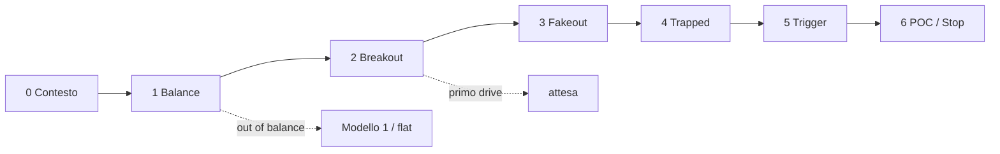

# Modello 2 — Mean Reversion · Analisi implementazione

**Fonte:** transcript *Trading LIVE with the #1 Scalper in the WORLD (EXTREME Accuracy)*  
**Stato codice:** [AGENTS.md](../../AGENTS.md)

---

## Tesi

Mean reversion in mercato **in balance**. Il segnale non nasce da wick, delta o CVD isolati, ma dalla sequenza:

**profile → breakout → fakeout → trapped side → aggressione → rientro → target POC**

> *"Model 2 is mean reverting... consolidation... out of balance condition that gets back inside balance."*

**Prerequisito assoluto:** mercato in consolidamento. Se out of balance → Modello 1 o flat.

---

## Pipeline — 7 step

Ogni step ha un gate: se fallisce, i successivi non producono trigger.

| Step | Nome | Cosa fa | Gate / output |
|------|------|---------|---------------|
| **0** | Contesto | Sessione London, range, no trend forte | `VALID` / `RISKY` / `INVALID` |
| **1** | Balance | Session profile → POC, VAH, VAL | `BALANCE_READY` / `NO_PROFILE` / `OUT_OF_BALANCE` |
| **2** | Breakout | Prezzo esce oltre VAH/VAL (min ticks) | `FIRST_BREAKOUT_WAIT` — **no entry** |
| **3** | Fakeout | Breakout senza follow-through, rientro verso value | `FAKEOUT_WATCH` |
| **4** | Trapped | Aggressione fuori value + no follow-through + recupero livello | `TRAPPED_*_WATCH` |
| **5** | Trigger | Second drive: big trade + recovery level / squeeze | `TRIGGER_LONG` / `TRIGGER_SHORT` |
| **6** | Gestione | Target POC, stop failed area, invalidazione | `INVALIDATED` se rottura con follow-through |



### Step 1 — Balance (implementare per primo)

- **Range:** prima barra sessione (`IsNewSession`) → barra corrente
- **Calcolo:** volume per price level → POC, VAH, VAL (value area 70%)
- **Valido se:** profile con volume sufficiente, prezzo inside/near value, VAH/VAL protettivi
- **Visual:** istogramma sessione, linee POC/VAH/VAL, marker SESSION START/END

### Step 2–3 — Breakout e fakeout

- Breakout = close oltre VAH/VAL di almeno `MinBreakoutTicks`
- **Regola Fabio:** primo drive ignorato (`RequireSecondDrive = true`)
- Fakeout = breakout senza momentum → prezzo rientra inside value (`ReentryTicks`)

### Step 4–5 — Trapped side e trigger

| Condizione | Conferma trapped | Trigger |
|------------|------------------|---------|
| Prezzo sotto VAL | sell aggression, no follow-through, recupero verso value | big buy ≥ filtro + break micro swing high / squeeze sellers |
| Prezzo sopra VAH | buy aggression, no follow-through, rientro in value | big sell ≥ filtro + recovery level / squeeze buyers |

- **Big trades:** executions/bubbles, non limit orders — London ~20, NY ~30 contratti
- **CVD:** solo conferma/gestione, mai trigger standalone
- **Assorbimento:** big trade + prezzo che non segue + livello profile (non delta barra isolato)

### Step 6 — Target e stop

| Elemento | Regola |
|----------|--------|
| **Target** | POC (bulk of auction), non l'altro lato del range |
| **Stop** | sotto/sopra failed breakout e cluster aggressione — sbagliarsi subito |
| **Invalida** | rottura livello con follow-through → narrative flip |

---

## State machine

| Stato | Step | Entry permessa |
|-------|------|----------------|
| `NO_TRADE_CONTEXT` | 0–1 | No |
| `BALANCE_READY` | 1 | No — attendere breakout |
| `FIRST_BREAKOUT_WAIT` | 2 | No |
| `FAKEOUT_WATCH` | 3 | No |
| `TRAPPED_SELLERS_LONG_WATCH` | 4 | No |
| `TRAPPED_BUYERS_SHORT_WATCH` | 4 | No |
| `TRIGGER_LONG` / `TRIGGER_SHORT` | 5 | Sì |
| `INVALIDATED` | 6 | No — reset scenario |

Transizioni chiave:

```
NO_PROFILE → BALANCE_READY          (profile valido)
BALANCE_READY → FIRST_BREAKOUT_WAIT (rottura VAH/VAL)
FIRST_BREAKOUT_WAIT → FAKEOUT_WATCH (no follow-through)
FAKEOUT_WATCH → TRAPPED_*_WATCH     (aggressione + recupero)
TRAPPED_*_WATCH → TRIGGER_*         (second drive + big trade)
* → INVALIDATED                     (rottura con follow-through)
```

---

## Input ATAS

| Categoria | Dato | API / fonte |
|-----------|------|-------------|
| Profile | volume, ask, bid per livello | `GetCandle(bar).GetAllPriceLevels()` |
| Sessione | inizio range profile | `IsNewSession(bar)` |
| Big trades | executions | `OnCumulativeTrade` → fallback `OnNewTrade` |
| Struttura | swing, close vs VAH/VAL | candele + livelli profile |
| Pressione | CVD, delta live | cumulo barra / tick — **filtro only** |

**Timeframe:** context (es. 5m) e execution (es. 1m) separati — non hardcoded.

---

## Output indicatore

### Chart

POC / VAH / VAL · LVN · nodi aggressione · tag: `WATCH LONG`, `TRIGGER LONG`, `WATCH SHORT`, `TRIGGER SHORT`, `INVALID`

### Box (sempre visibile)

```
STATO:   TRAPPED_SELLERS_LONG_WATCH
DOVE:    sotto VAL, rientro parziale
MANCA:   big buy ≥ 20 + break recovery level
TARGET:  POC 21280.50 (+12t)
INVALIDA: close sotto 21260 con sell follow-through
```

### Log

Stesso testo del box + snapshot: price, POC/VAH/VAL, dist POC, big trades, delta livello, CVD, stato.

---

## Parametri

| Parametro | Default | Step |
|-----------|---------|------|
| `ValueAreaPercent` | 70 | 1 |
| Session profile start | `IsNewSession` | 1 |
| `MinBreakoutTicks` | 4 | 2 |
| `ReentryTicks` | 2 | 3 |
| `RequireSecondDrive` | true | 2–5 |
| `BigTradeFilter` | 20 (London) | 5 |
| `BigTradeFilterNY` | 30 | 5 |
| `UseCumulativeTrades` | true | 5 |
| `LvnSensitivity` | 0.35 | 1 (refinement) |
| `TargetMode` | POC | 6 |

---

## Non-segnali (declassare)

Da soli → `CONTEXT` / `WATCH` / `WAIT_CONFIRMATION`, mai `TRIGGER`:

| Segnale legacy | Problema | Azione |
|----------------|----------|--------|
| `FAILED_AUCTION` (wick) | fuori contesto profile | WATCH solo se oltre VAH/VAL |
| `CVD_*_DIV` | standalone | conferma only |
| `SQUEEZE` (Δsum) | generico | trapped + recovery level |
| `ABSORPTION` (delta barra) | generico | big trade + no follow-through a livello |
| `LONG?` / `SHORT?` | ambigui | `WATCH_*` / `TRIGGER_*` |

---

## Ordine implementazione

1. **Step 1** — profile engine + rendering + `BALANCE_READY`
2. **Step 2–3** — breakout/fakeout detection + stati wait/watch
3. **Step 4** — trapped side (big trades + no follow-through)
4. **Step 5** — trigger + tag chart
5. **Step 6** — target POC, stop, invalidazione + box/log

Rimuovere dal codice legacy: `DetectFailedAuction`, `DetectSqueezeSetup`, `DetectAbsorption`, `DetectCvdDivergence` come trigger autonomi.

---

*Fabio Valentino · Modello 2 Mean Reversion · orderflow-atas*