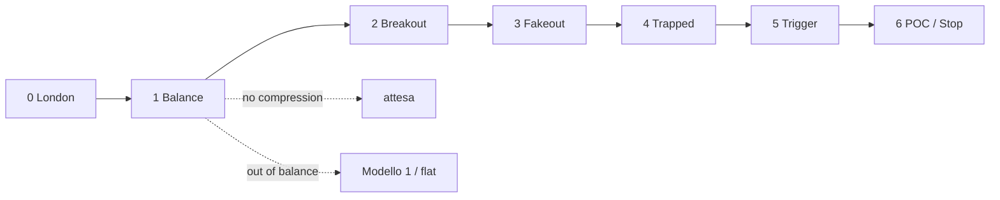

# Modello 2 — Mean Reversion · Analisi implementazione

**Fonte:** transcript *Trading LIVE with the #1 Scalper in the WORLD (EXTREME Accuracy)*  
**Stato codice:** [AGENTS.md](../../AGENTS.md)

---

## Tesi

Mean reversion in mercato **in balance**. Il segnale non nasce da wick, delta o CVD isolati, ma dalla sequenza:

**profile → breakout → fakeout → trapped side → aggressione → rientro → target POC**

> *"Model 2 is mean reverting... consolidation... out of balance condition that gets back inside balance."*

**Prerequisito assoluto:** mercato in consolidamento. Se out of balance → Modello 1 o flat.

---

## Pipeline — 7 step

| Step | Nome | Cosa fa | Gate / output |
|------|------|---------|---------------|
| **0** | Contesto | Sessione London (`TradingSessionDescriptions`) | `VALID` / `RISKY` / `INVALID` |
| **1** | Balance | Compression profile → POC, VAH, VAL | vedi stati sotto |
| **2** | Breakout | Prezzo esce oltre VAH/VAL | `FIRST_BREAKOUT_WAIT` — no entry |
| **3** | Fakeout | Breakout senza follow-through, rientro verso value | `FAKEOUT_WATCH` |
| **4** | Trapped | Aggressione fuori value + no follow-through + recupero | `TRAPPED_*_WATCH` |
| **5** | Trigger | Second drive + big trade / squeeze | `TRIGGER_LONG` / `TRIGGER_SHORT` |
| **6** | Gestione | Target POC, stop, invalidazione | `INVALIDATED` |



---

## Step 1 — Balance

### Dal transcript

Il punto difficile è *"correctly identifying the consolidation"*. Fabio traccia il Volume Profile sull'**area di compressione** — dove il mercato *"didn't transact higher or lower"* — e da lì estrae POC, VAH, VAL.

| Timestamp | Cosa dice Fabio |
|-----------|-----------------|
| ~47:17 | *"The tricky part is correctly identifying the consolidation"* |
| ~47:28 | Metodo semplice: *"I use the profile of the previous day"* |
| ~47:47 | Metodo operativo: *"You see the compressed candles and you just plot the profile on there"* |
| ~59:45 | *"Identifying the most interesting compression area... where the market didn't transact higher or lower"* |
| ~1:00:24 | *"You don't identify it immediately... it's too early"* |
| ~1:11:19 | Dentro la stessa consolidazione: *"from here to here... new dealing range"* → replot profile |
| ~1:26:07 | Su 1m: *"profile from the first ball to the last ball"* per micro-compressione |
| ~3:01:26 | *"The consolidation era is still the same"* — finché VAH/VAL non rompono |
| ~3:01:40 | Validazione live: *"Did it break the value area low? No. Did it break the value area high? Yes."* |

Due concetti distinti:

| Concetto | Cosa è | Ruolo |
|----------|--------|-------|
| **Sessione London** (Step 0) | *"You're looking at potentially London"* — finestra operativa | **Quando** si opera |
| **Zona di balance** (Step 1) | Profile su area di compressione → POC/VAH/VAL | **Dove** è il range e i livelli |

`IsNewSession` serve per Step 0 (London via `TradingSessionDescriptions`). Il range profile parte dall'inizio compressione, non da `IsNewSession`.

| Elemento | Regola |
|----------|--------|
| Range profile | Inizio compressione → barra corrente (rolling) |
| Timing | Quando la compressione è **visibile**; altrimenti `NO_COMPRESSION` (*"too early"*) |
| Fallback | Daily profile del giorno precedente (contesto macro) |
| Replot | Nuovo range *"from here to here"* dentro la stessa *consolidation era* |
| Fine balance | Rottura VAH/VAL con follow-through → fine era, cerca nuova compressione |

### Cosa fa Fabio per individuare la balance

**Modalità A — Semplice (contesto macro)**

> *"You can make it stupid simple putting just daily profile."*  
> *"I use the profile of the previous day."*

Profile del **giorno precedente** → POC/VAH/VAL come riferimento. Facile, meno preciso intraday.

**Modalità B — Operativa (Modello 2 live)**

> *"You see the compressed candles and you just plot the profile on there."*

1. Individua dove il mercato **non transa più alto né basso** (compressione visibile)
2. Traccia il Volume Profile **solo su quell'area**
3. Estrae POC, VAH, VAL (value area del profile — bulk of auction)
4. Verifica che il profile **protegga** i confini

> *"Market state is consolidation and is when the profile is protecting from breaking here and breaking here."*

**Refinement intraday**

| Situazione | Fabio | Azione sul profile |
|------------|-------|-------------------|
| Nuovo dealing range dentro la stessa consolidazione | *"From here to here... new dealing range"* | Replot sul nuovo range compressione |
| Micro-contesto su 1m | *"Profile from the first ball to the last ball"* | Profile tra primo/ultimo cluster aggressione |
| Era di consolidazione ancora valida | *"The consolidation era is still the same"* | Stessi VAH/VAL finché non rompono |
| Era finita | *"Did it break VAH? ... Did it break VAL?"* con follow-through | Reset → cerca nuova compressione |

**Cosa NON è balance**

- Profile del giorno intero come **unico** input operativo (è contesto, non trigger)
- Profile da inizio sessione se **non** coincide con la compressione
- Profile tracciato **troppo presto** — *"it's too early"*
- Mercato con momentum — *"small orders balance → someone buying aggressively and continuation"*
- Giornata di news/gap estremo (es. bombing Iran nel video) — contesto `RISKY`

### Principio: tutto dinamico (tranne big trades)

Fabio non ragiona con numeri fissi su struttura e profile. Compressione, breakout, fakeout e follow-through emergono dal **contesto live**: range recente, volume, livelli VAH/VAL, comportamento post-rottura.

**Eccezione — filtro big trade:** sulle executions usa una **soglia fissa in contratti**, oggettiva e testabile:

| Timestamp | Cosa dice Fabio |
|-----------|-----------------|
| ~24:47 | *"Put a filter of 30 contracts on NASDAQ on the one minute... you will see the ball. So it's really objective."* |
| ~1:31:44 | *"For the five minutes and one minutes for New York session you can use 30 contract as a filter."* |
| ~1:31:52 | *"During London session you can go with 20. It's pretty accurate."* |
| ~1:31:58 | Bubble più grande del filtro = aggressione maggiore (es. 100 contratti) — size proporzionale sul chart |

| Sessione | Timeframe | Filtro big trade (NQ) |
|----------|-----------|------------------------|
| **London** | 1m / 5m | **20 contratti** |
| **New York** | 1m / 5m | **30 contratti** |

API: `OnCumulativeTrade` (fallback `OnNewTrade`) — print ≥ soglia sessione = "ball" visibile.

| Area | Logica |
|------|--------|
| Compressione, profile, VAH/VAL | Dinamica — relativa a range e volume del momento |
| Breakout / fakeout | Dinamica — livello profile + follow-through |
| **Big trades / balls** | **Soglia fissa** per sessione (20 London, 30 NY) |

### Specifica implementativa

#### A. Trovare l'area di compressione

Fabio seleziona visivamente l'area dove il prezzo *"didn't transact higher or lower"*. In codice il range profile è **rolling**: fine = barra corrente, inizio = dove inizia la compressione rilevata.

**Algoritmo `FindCompressionStart(bar)`:**

```
1. Da bar corrente, scansiona all'indietro
2. Trova l'ultimo impulse — leg direzionale con espansione del range
   (close oltre swing precedente, range/volume in crescita vs leg precedente)
3. Inizio compressione = prima barra dopo l'impulse dove high/low restano
   contenuti in un range nettamente più stretto del leg espansivo
4. Conferma: il range della compressione non si espande in modo direzionale;
   le candele sono "compressed" rispetto al contesto appena precedente
```

Se la compressione non è ancora leggibile sul chart → `NO_COMPRESSION` (*"too early"*).

#### B. Costruire il profile sul range

```
Per ogni barra nell'area di compressione (inizio → corrente):
  per ogni livello in GetCandle(b).GetAllPriceLevels():
    accumula volume per prezzo

POC  = prezzo con volume massimo
VAH/VAL = value area (bulk of auction) espansa dal POC fino a ~70% del volume
```

API ATAS: `GetCandle(bar).GetAllPriceLevels()` → `Price`, `Volume`, `Ask`, `Bid`.

#### C. Validare che sia balance (non solo profile calcolabile)

| Check | Fabio | Logica dinamica |
|-------|-------|-----------------|
| Compressione visibile | Candele strette, no espansione direzionale | Range corrente contratto vs ultimo impulse; profile accumula volume sufficiente |
| Profile protettivo | VAH/VAL tengono | Tentativi di rottura senza follow-through sostenuto |
| Prezzo in value | Oscilla nel balance | Close dentro/near value area definita dal profile stesso |
| No momentum | No aggressione continua oltre confini | Aggressione oltre VAH/VAL non produce continuation |

#### D. Stati Step 1

| Stato | Significato | Equivalente Fabio |
|-------|-------------|-------------------|
| `NO_COMPRESSION` | Compressione non ancora visibile | *"too early"* |
| `COMPRESSION_FORMING` | Range c'è, profile sottile o confini non ancora affidabili | Compressione in formazione |
| `BALANCE_READY` | POC/VAH/VAL validi, confini protettivi, prezzo in/near value | *"consolidation era"* attiva |
| `OUT_OF_BALANCE` | Rottura VAH/VAL con follow-through | Fine era → Modello 1 o flat |

#### E. Quando si aggiorna / si resetta

| Evento | Azione |
|--------|--------|
| Nuova barra in compressione | Profile rolling: estendi range fino a barra corrente |
| Nuovo dealing range (*"from here to here"*) | Replot: nuovo inizio compressione |
| Rottura VAH/VAL con follow-through | Fine *"consolidation era"* → reset, cerca nuova compressione |
| Modalità fallback | `PreviousDayProfile` per contesto macro |

#### F. Timeline tipica London

```
London open
    │
    ▼
NO_COMPRESSION          → "too early", profile instabile
    │
    ▼  (compressione diventa visibile)
COMPRESSION_FORMING     → range rilevato, POC/VAH/VAL emergono
    │
    ▼
BALANCE_READY           → confini tengono, prezzo in value
    │
    ▼
Step 2+ (breakout, fakeout, trigger...)
    │
    ▼
OUT_OF_BALANCE          → rottura con follow-through, era finita
```

#### G. Pseudocodice Step 1

```csharp
// Gate Step 0
if (!IsInLondonSession(bar)) return;

// A — compressione (NON session start)
var compressionStart = FindCompressionStart(bar);
if (compressionStart < 0) { State = NO_COMPRESSION; return; }

// B — profile sulla compressione
var profile = BuildProfile(compressionStart, bar);
if (!profile.IsValid) { State = COMPRESSION_FORMING; return; }

// C — è balance?
if (BrokeWithFollowThrough(bar, profile.VAH, profile.VAL))
    State = OUT_OF_BALANCE;
else if (profile.IsProtective(bar))
    State = BALANCE_READY;
else
    State = COMPRESSION_FORMING;
```

---

## Step 2–6 (invariati nella logica)

### Step 2–3 — Breakout e fakeout

- Breakout = close oltre VAH/VAL (il livello profile **è** la soglia)
- **Regola Fabio:** primo drive ignorato — attendere il secondo tentativo
- Fakeout = breakout senza follow-through → prezzo rientra inside value

Follow-through = prezzo **continua** oltre il livello con aggressione sostenuta; fakeout = tentativo che **non tiene**.

### Step 4–5 — Trapped side e trigger

| Condizione | Conferma trapped | Trigger |
|------------|------------------|---------|
| Prezzo sotto VAL | sell aggression (ball ≥ filtro), no follow-through, recupero verso value | big buy ≥ filtro + recovery / squeeze |
| Prezzo sopra VAH | buy aggression (ball ≥ filtro), no follow-through, rientro in value | big sell ≥ filtro + recovery / squeeze |

- **Big trades:** filtro fisso — **20 contratti** London, **30 contratti** NY su 1m/5m NQ (*"you will see the ball"*)
- **CVD:** conferma/gestione only
- **Assorbimento:** ball ≥ filtro + no follow-through a livello profile

### Step 6 — Target e stop

| Elemento | Regola |
|----------|--------|
| **Target** | POC (bulk of auction) |
| **Stop** | sotto/sopra failed breakout e cluster aggressione |
| **Invalida** | rottura con follow-through |

---

## State machine (aggiornata)

| Stato | Step | Entry |
|-------|------|-------|
| `NO_COMPRESSION` | 1 | No |
| `COMPRESSION_FORMING` | 1 | No |
| `BALANCE_READY` | 1 | No — attendere breakout |
| `FIRST_BREAKOUT_WAIT` | 2 | No |
| `FAKEOUT_WATCH` | 3 | No |
| `TRAPPED_SELLERS_LONG_WATCH` | 4 | No |
| `TRAPPED_BUYERS_SHORT_WATCH` | 4 | No |
| `TRIGGER_LONG` / `TRIGGER_SHORT` | 5 | Sì |
| `OUT_OF_BALANCE` | 1+ | No — reset / Modello 1 |
| `INVALIDATED` | 6 | No — reset scenario |

```
NO_COMPRESSION → COMPRESSION_FORMING    (compressione rilevata)
COMPRESSION_FORMING → BALANCE_READY     (profile protettivo)
BALANCE_READY → FIRST_BREAKOUT_WAIT     (rottura VAH/VAL)
FIRST_BREAKOUT_WAIT → FAKEOUT_WATCH     (no follow-through)
FAKEOUT_WATCH → TRAPPED_*_WATCH         (aggressione + recupero)
TRAPPED_*_WATCH → TRIGGER_*             (second drive + big trade)
BALANCE_READY → OUT_OF_BALANCE          (rottura VAH/VAL + follow-through)
* → INVALIDATED                         (invalidazione trade)
```

---

## Input ATAS

| Categoria | Dato | API / fonte |
|-----------|------|-------------|
| Profile | volume per livello | `GetCandle(bar).GetAllPriceLevels()` |
| London (Step 0) | sessione chart | `ChartInfo.TradingSessionDescriptions` + `IsNewSession(bar)` |
| Compressione (Step 1) | range high/low, swing | candele — **non** `IsNewSession` come start profile |
| Big trades | executions ≥ 20 (London) / 30 (NY) | `OnCumulativeTrade` → fallback `OnNewTrade` |
| Struttura | close vs VAH/VAL | candele + livelli profile |
| Pressione | CVD, delta | filtro only |

**Timeframe:** context (es. 5m) + execution (es. 1m), separati.

---

## Logica per step

| Step | Input | Decisione |
|------|-------|-----------|
| **0** | Sessione chart (`TradingSessionDescriptions`) | London attiva o no |
| **1** | Range vs ultimo impulse; volume per livello | Compressione visibile → POC/VAH/VAL; profile protettivo o no |
| **2** | Close vs VAH/VAL | Breakout; primo drive scartato |
| **3** | Follow-through dopo breakout | Fakeout se rientro in value senza continuation |
| **4** | Ball ≥ filtro sessione fuori value + recupero | Trapped side |
| **5** | Ball ≥ filtro + second drive | Trigger |
| **6** | POC come bulk of auction; struttura failed breakout | Target, stop, invalidazione |

**Compressione:** range contratto vs ultimo leg espansivo — dinamico.

**Breakout/fakeout:** VAH/VAL + follow-through — dinamico.

**Big trade:** soglia fissa per sessione (20 London / 30 NY, 1m e 5m NQ) — unica eccezione numerica esplicita nel transcript.

---

## Output indicatore

### Chart

- Profile sull'area di compressione (istogramma + value area evidenziata)
- Linee POC / VAH / VAL limitate al range compressione
- Marker `COMPRESSION START` / `COMPRESSION END`
- Paintbar London (Step 0, già in codice)
- Tag operativi: `WATCH LONG`, `TRIGGER LONG`, ecc. (Step 5+)

### Box

```
STATO:   BALANCE_READY
DOVE:    inside value, close 21278
PROFILE: compression bar 142–187 (46 bars)
POC:     21280.50 | VAH: 21295 | VAL: 21265
```

---

## Non-segnali (declassare)

| Segnale legacy | Problema | Azione |
|----------------|----------|--------|
| `FAILED_AUCTION` (wick) | fuori contesto profile | WATCH solo se oltre VAH/VAL |
| `CVD_*_DIV` | standalone | conferma only |
| `SQUEEZE` (Δsum) | generico | trapped + recovery level |
| `ABSORPTION` (delta barra) | generico | big trade + no follow-through |
| Profile da `IsNewSession` | range ≠ compressione | range = area compressione |

---

## Ordine implementazione

| # | Step | Stato codice |
|---|------|--------------|
| 1 | **0** — London session (`TradingSessionDescriptions`) | ✅ fatto |
| 2 | **1** — compressione dinamica + profile + stati balance | da fare |
| 3 | **2–3** — breakout / fakeout | da fare |
| 4 | **4** — trapped side | da fare |
| 5 | **5** — trigger | da fare |
| 6 | **6** — target POC, stop, box/log | da fare |

---

*Fabio Valentino · Modello 2 Mean Reversion · orderflow-atas*