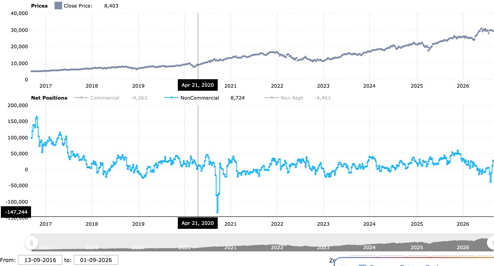

# COT Legacy Sugli Indici: Estrazione Da Tradingster E Verifica Della Metrica Cross-Index

Data: 2026-09-11. Stato: studio descrittivo. Nessuna regola operativa approvata.

## Scopo

Il live Q1 (`fabio_course/fabio_q1/fabio_live_charting_1_q1.txt`, minuti `26:21`-`38:30`) descrive una lettura del Commitment of Traders fatta a mano su `tradingster.com`, con una metrica di conferma incrociata fra indici americani. Finora quella lettura era documentata solo a parole in `fabio_course/fabio-course-model-map.md`. Questo studio fa due cose:

1. rende la fonte esterna riproducibile, estraendo le serie direttamente dalla UI invece che leggendole a occhio;
2. verifica in modo descrittivo se la metrica cross-index, resa esplicita, abbia una qualche relazione con il prezzo successivo.

Lo studio non introduce un modello e non autorizza nessuna esecuzione.

## Come Sono Stati Ottenuti I Dati

Le pagine legacy di Tradingster costruiscono i loro grafici con la libreria amCharts. Ogni pagina carica nel browser, in `AmCharts.charts[...].dataProvider`, **l'intera serie settimanale degli ultimi dieci anni**: posizione netta, Long e Short per ciascuna categoria di trader, piu' l'OHLC settimanale del prezzo. Il numero mostrato nella tabella in cima alla pagina e' quindi solo l'ultimo punto di una serie gia' presente nella pagina.

La raccolta e' stata fatta con il server MCP Playwright configurato in `.mcp.json`: si apre la pagina, si legge il `dataProvider` e si salva il risultato come JSON. Non e' scraping dell'HTML e non dipende dal layout della pagina.

```text
https://tradingster.com/cot/legacy-futures/13874+    S&P 500 Consolidated
https://tradingster.com/cot/legacy-futures/209742    Nasdaq-100 Mini  (NASDAQ 100 STOCK INDEX X $20)
https://tradingster.com/cot/legacy-futures/124603    DJIA x $5
https://tradingster.com/cot/legacy-futures/239742    Russell 2000 E-Mini
```

Copertura ottenuta, tutte con report `as of 2026-09-01`:

| Mercato | Settimane | Prima data | Ultima data |
|---|---|---|---|
| S&P 500 Consolidated | 520 | 2016-09-13 | 2026-09-01 |
| Nasdaq-100 Mini | 520 | 2016-09-13 | 2026-09-01 |
| DJIA x $5 | 520 | 2016-09-13 | 2026-09-01 |
| Russell 2000 E-Mini | 472 | 2017-08-15 | 2026-09-01 |

Lo script `FabioOrderFlow/tools/build_cot_cross_index.py` unifica i quattro JSON in `docs/research/data/cot-legacy-indices-weekly.csv` (2.032 righe settimanali) e calcola le due metriche descritte sotto.

## Lo Stato Attuale, Report 2026-09-01

Livelli Non-Commercial e loro posizione nello storico decennale:

| Mercato | Netto | Percentile su 10 anni | Minimo | Massimo |
|---|---|---|---|---|
| Nasdaq-100 Mini | +25.890 | 71% | -134.311 | +162.662 |
| DJIA x $5 | +17.328 | 66% | -37.076 | +95.721 |
| S&P 500 | -89.371 | 18% | -417.792 | +120.581 |
| Russell 2000 Mini | -71.663 | 10% | -119.954 | +72.600 |

Variazioni dell'ultima pubblicazione, cioe' la riga che Fabio legge per prima:

| Mercato | Delta Long | Delta Short | Delta netto |
|---|---|---|---|
| Nasdaq-100 Mini | +802 | -15.049 | +15.851 |
| DJIA x $5 | +866 | -905 | +1.771 |
| S&P 500 | +1.960 | +13.156 | -11.196 |
| Russell 2000 Mini | -1.776 | +18.309 | -20.085 |

Le due letture sono **divergenti**: nella stessa settimana il flusso e' long su Nasdaq e Dow, short su S&P 500 e Russell. Applicata onestamente, la metrica cross-index non produce alcun consenso per questa settimana. E' l'esito piu' utile da registrare, perche' mostra che la regola sa anche restituire "nessun contesto".

Nota aritmetica: sul Nasdaq il netto migliora di 15.851 contratti quasi interamente per **chiusura di short** (-15.049), non per apertura di long (+802). Il netto da solo non distingue i due casi: e' esattamente l'informazione che l'indicatore ATAS `COT Net positions` non puo' restituire e la ragione tecnica per cui la fonte esterna resta necessaria.



L'immagine riproduce il passaggio del live in cui Fabio nasconde `Commercial` e `Non-Reportable` per isolare la serie speculativa. Mostra anche perche' il livello attuale non e' un estremo: il netto Nasdaq oscilla quasi sempre fra -50.000 e +60.000 dal 2018, con un massimo di +162.662 nel 2016-17 e un minimo di -134.311 nell'aprile 2020. Il +25.890 di oggi e' un valore centrale, non un'ala della distribuzione.

## La Metrica Cross-Index, Resa Esplicita

Nel live la regola e' enunciata cosi': se la maggioranza degli indici mostra nell'ultima pubblicazione una variazione forte nella stessa direzione, il contesto e' coerente; la forza e' esemplificata con "1.000 long contro 5.000 short". Per verificarla serve una definizione numerica. Ne sono state usate due, entrambe dichiarate, perche' la conclusione non dipenda da una sola convenzione.

**Criterio A, rapporto di skew.** Misura quanto la variazione settimanale e' sbilanciata:

```text
skew = (delta long - delta short) / (|delta long| + |delta short|)
soglia: |skew| >= 0,30      consenso: almeno 3 indici su 4 concordi, nessuno contrario
```

**Criterio B, grandezza normalizzata.** Il criterio A ha un difetto: satura a `+-1` ogni volta che le variazioni long e short hanno segno opposto, quindi non distingue una settimana ordinaria da una estrema. Il criterio B normalizza invece la variazione netta sulla sua variabilita' recente:

```text
z = delta netto / deviazione standard del delta netto sulle 52 settimane precedenti
soglia: |z| >= 1,0         consenso: almeno 3 indici su 4 concordi, nessuno contrario
```

## Risultato

Frequenza dei verdetti e variazione del Nasdaq nelle quattro settimane successive:

| Criterio | Verdetto | Settimane | Quota | Variazione NQ a 4 settimane, media | Mediana | Quota positive |
|---|---|---|---|---|---|---|
| A | long | 58 | 11,2% | +1,13% | +1,17% | 62,1% |
| A | short | 57 | 11,0% | +1,23% | +1,90% | 66,7% |
| A | nessuno | 404 | 77,8% | +1,66% | +2,20% | 68,8% |
| B | long | 3 | 0,7% | +2,96% | +2,23% | 100,0% |
| B | short | 12 | 2,9% | -2,73% | -2,77% | 41,7% |
| B | nessuno | 404 | 96,4% | +1,60% | +2,23% | 66,0% |

Due letture distinte:

- **Il criterio A non separa nulla.** Le settimane con consenso long e quelle con consenso short hanno la stessa risposta successiva, e nessuna delle due batte le settimane senza consenso, che anzi mostrano la media piu' alta. Con questa definizione la metrica cross-index non contiene informazione direzionale sulle quattro settimane seguenti.
- **Il criterio B separa nella direzione attesa, ma su un campione troppo piccolo per concludere.** Dodici settimane di consenso short precedono un Nasdaq in calo del 2,73% medio, contro un +1,60% delle settimane neutre; le tre settimane di consenso long precedono un rialzo. E' coerente con la tesi del live, ma dodici e tre osservazioni, per giunta su finestre sovrapposte e in un decennio a trend rialzista, non sono una verifica. Sono un'indicazione su cosa misurare meglio.

In entrambi i casi il periodo osservato copre un mercato prevalentemente in salita: la media incondizionata a quattro settimane e' positiva, e qualunque regola va confrontata con quella, non con lo zero.

## Limiti

- Il campione e' un solo decennio di dati settimanali, con finestre sovrapposte. Le statistiche riportate sono descrittive; non sono stati calcolati intervalli di confidenza ne' e' stata fatta alcuna correzione per test multipli.
- Le soglie `0,30`, `z = 1,0`, `52` settimane, `3 su 4` e l'orizzonte di quattro settimane sono convenzioni di questo repository. Sceglierne altre cambierebbe i numeri: nessuna e' stata validata fuori campione.
- La risposta di prezzo e' misurata solo sul Nasdaq, perche' e' lo strumento operato. Il consenso, pero', e' costruito su quattro mercati con moltiplicatori diversi (S&P $50, Nasdaq mini $20, Dow $5): il conteggio dei contratti non e' esposizione economica comparabile.
- Il report legacy usato e' futures only. Esiste anche la variante futures + options, con numeri diversi; confronti fra osservazioni richiedono di dichiarare quale si usa.
- I dati provengono dalla visualizzazione Tradingster, non dai file CFTC. Per un uso formale la fonte da citare resta il rilascio CFTC del venerdi, riferito al martedi precedente.
- `Spreads` della riga Non-Commercial non e' esposizione direzionale e non entra in nessuno dei calcoli qui riportati.

## Conseguenza Per Il Progetto

Il COT resta quello che la mappa del corso gia' dichiarava: contesto settimanale, non trigger. Questo studio aggiunge che, nella forma piu' letterale della regola cross-index, il contesto non mostra relazione con il prezzo successivo; nella forma piu' selettiva la mostra, ma su troppe poche occorrenze per fidarsene. Non c'e' quindi motivo, al momento, di dare al COT un peso decisionale sopra il profilo e l'order flow, ne' di costruirci un indicatore ATAS.

Il passo successivo utile, se lo si vuole fare, e' estendere la raccolta ai file CFTC per avere piu' storia e la variante futures + options, e verificare se il criterio B regge su un campione piu' ampio.

## Riproducibilita'

```bash
# 1. estrarre i dataProvider dalle quattro pagine legacy con il MCP Playwright,
#    salvando cot-13874.json, cot-209742.json, cot-124603.json, cot-239742.json
# 2. costruire tabella e riepilogo
python3 FabioOrderFlow/tools/build_cot_cross_index.py <cartella-json> docs/research/data/cot-legacy-indices-weekly.csv
```
